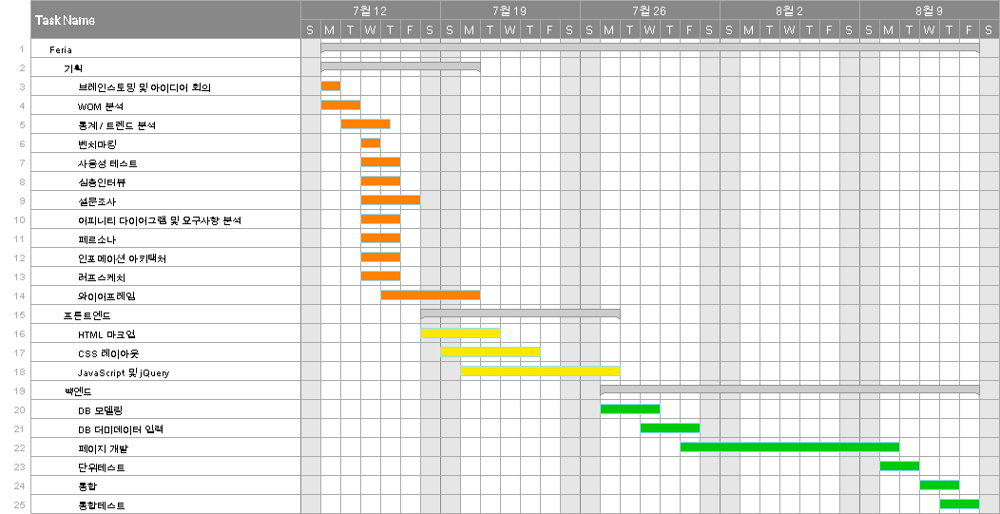
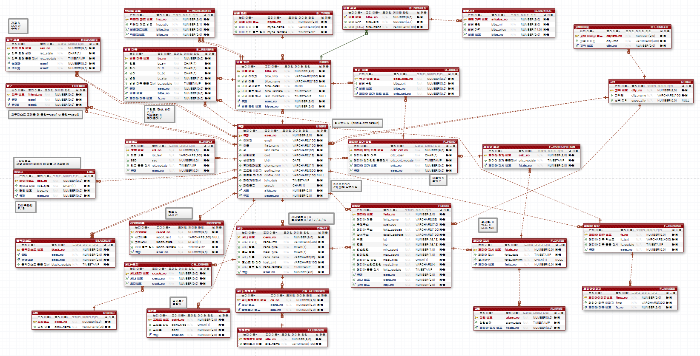
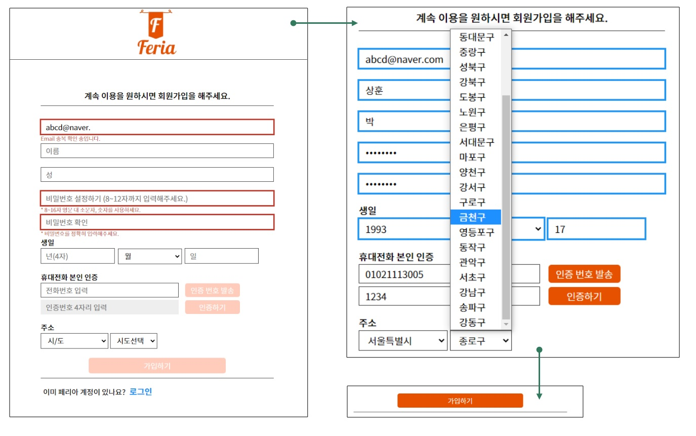
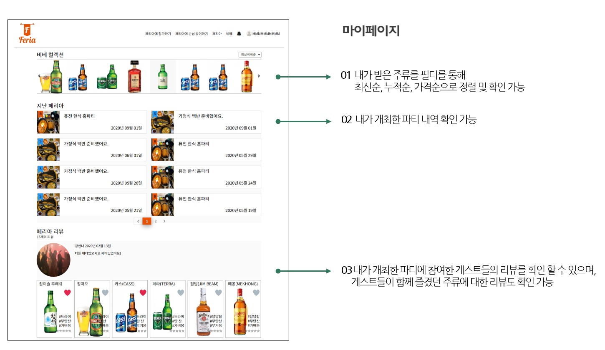

# 페리아(Feria)

## 프로젝트 개요
- 프로젝트명 : 페리아(Feria)
- 모델1 방식으로 개발 후 MVC 패턴을 도입하여 변환

## 프로젝트 주요 내용
**개발목표**
- 새로운 개념의 여행 서비스 고안(파티 참가인원 랜덤 매칭 기능 제공)

**개발환경**
- (OS) Window 7 · 10 
- (Framework) Spring · mybatis
- (DB) Oracle DB
- (Development Tool) Eclipse, WebStorm, Sql Developer, Apache-Tomcat
- (Skills) HTML5, CSS, Java Script, jQuery, JSP & Servlet, Java8, SQL

**담당역할**
- 페이지네이트
- 카카오 지도 API
- Ajax를 활용한 상태에 따른 옵션 기능
- 정규표현식을 이용한 유효성 검사

**참여도/기여도**
- 100% / 30%

## DB 모델링

- 29개의 테이블 · 기본적으로 Foriegn Key를 사용했으나, 'LIKE' 테이블과 같은 특정 테이블에는 논리적 Foriegn Key를 사용

## 담당 화면 구성

